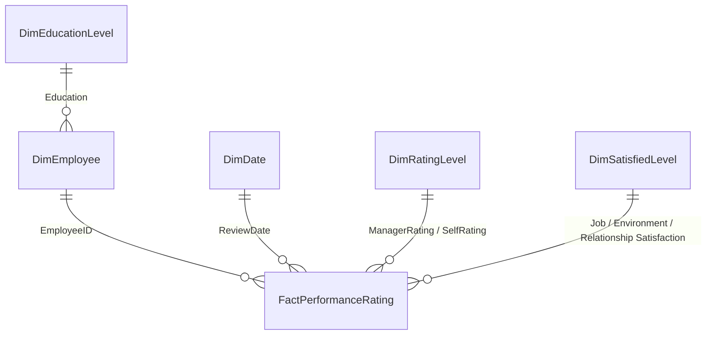

<div align="center">

# 🧭 Atlas Lab — HR Analytics Dashboard

### 📊 Employee Attrition & Performance Insights, built in Power BI


</div>

---

## 📌 About This Project

**Atlas Lab** is an interactive Power BI dashboard that turns raw HR records into a decision-ready view of the workforce: who's active, who's leaving, how satisfied people are, and how performance reviews trend over time.

It's built on a proper **snowflake-schema data model** (one fact table + five dimension tables, with lookup dimensions normalized off their parent dimension) and a dedicated **measures table** with 15 DAX calculations, then surfaced across **4 report pages**.

| 🧩 | What it covers |
|---|---|
| 👥 | Headcount, active vs. inactive employees, attrition rate |
| 🧬 | Demographics — gender, age bands, marital status, ethnicity, salary |
| 📈 | Per-employee performance tracking — satisfaction & rating trends over years |
| 🚪 | Attrition drivers — department, travel frequency, overtime, tenure, hire date |

---

## 🖥️ Dashboard Pages

### 1️⃣ Overview
KPI cards (Total / Active / Inactive Employees, Attrition Rate), a year-by-year hiring trend split by attrition, and an active-employee breakdown by department → job role.


### 2️⃣ Demographics
Youngest/oldest employee, headcount by gender × age bin, marital status split, and total employees & average salary by ethnicity.


### 3️⃣ Performance Tracker
A per-employee drill-down: satisfaction trends (Job, Relationship, Environment, Work-Life Balance), rating trends (Manager, Self), and current satisfaction/rating level distributions.


### 4️⃣ Attrition
Attrition by department, travel frequency, overtime, years at company, and hire-date year — pinpointing where and when people are leaving.


---

## 🧩 Data Model

The model follows a **snowflake schema**: one fact table at the center, surrounded by descriptive dimensions — with `DimEducationLevel` normalized one level further out, hanging off `DimEmployee` rather than connecting to the fact table directly — plus a standalone measures table.




| Table | Role | Key Columns |
|---|---|---|
| 🗃️ **FactPerformanceRating** | Fact (grain: one review per employee per cycle) | `EmployeeID`, `PerformanceID`, `ReviewDate`, `EnvironmentSatisfaction`, `JobSatisfaction`, `RelationshipSatisfaction`, `SelfRating`, `ManagerRating`, `TrainingOpportunitiesTaken` |
| 🧑‍💼 **DimEmployee** | Dimension — one row per employee | `EmployeeID`, `Age`, `Age Bins`, `Attrition`, `BusinessTravel`, `Department`, `DistanceFromHome (KM)`, `Education`, `EducationField` |
| 📅 **DimDate** | Calendar dimension | `Date`, `DayName`, `DayNameShort`, `DayNumber`, `DayOfWeek` |
| 🎓 **DimEducationLevel** | Lookup for education codes | `EducationLevelID`, `EducationLevel` |
| ⭐ **DimRatingLevel** | Lookup for the 1–4 rating scale | `RatingID`, `RatingLevel` |
| 🙂 **DimSatisfiedLevel** | Lookup for the 1–4 satisfaction scale | `SatisfactionID`, `SatisfactionLevel` |
| 🧮 **_Measures** | Empty calculated table used purely to host DAX measures (best-practice pattern, keeps measures out of physical tables) | — |

> 💡 Relationships from `DimRatingLevel` and `DimSatisfiedLevel` fan out to **several** fact columns (Manager/Self rating, Job/Environment/Relationship satisfaction). Only one relationship per lookup table is active at a time in the model; the others are inactive and switched in per-visual with `USERELATIONSHIP()` — a common pattern for role-playing dimensions.

---

## 🧮 Measures (`_Measures` table)

The `.pbix` stores its compiled model in a compressed binary format that can't be decompiled outside Power BI itself, so the DAX below is **reconstructed from the measure names, the model diagram, and how each one is used on the report pages** — swap in your real formulas if they differ.

| Measure | Purpose | Reconstructed DAX |
|---|---|---|
| **Total Employee** | Total headcount | `Total Employee = DISTINCTCOUNT(DimEmployee[EmployeeID])` |
| **Active Employee** | Employees currently with the company | `Active Employee = CALCULATE([Total Employee], DimEmployee[Attrition] = "No")` |
| **InActive Employee** | Employees who have left | `InActive Employee = CALCULATE([Total Employee], DimEmployee[Attrition] = "Yes")` |
| **Attrition Rate** | Share of the workforce that has left | `Attrition Rate = DIVIDE([InActive Employee], [Total Employee], 0)` |
| **Total Employee Date** | Headcount evaluated through the Date table (powers the demographic decomposition trees) | `Total Employee Date = CALCULATE([Total Employee])` |
| **Youngest Employee** | Minimum age in the current filter context | `Youngest Employee = MIN(DimEmployee[Age])` |
| **Oldest Employee** | Maximum age in the current filter context | `Oldest Employee = MAX(DimEmployee[Age])` |
| **Job** | Average job satisfaction score | `Job = AVERAGE(FactPerformanceRating[JobSatisfaction])` |
| **Environment** | Average environment satisfaction score | `Environment = AVERAGE(FactPerformanceRating[EnvironmentSatisfaction])` |
| **Relationship** | Average relationship satisfaction score | `Relationship = AVERAGE(FactPerformanceRating[RelationshipSatisfaction])` |
| **WorkLifeBalance** | Average work-life balance score | `WorkLifeBalance = AVERAGE(FactPerformanceRating[WorkLifeBalance])` |
| **Manager** | Average manager rating | `Manager = AVERAGE(FactPerformanceRating[ManagerRating])` |
| **Self** | Average self rating | `Self = AVERAGE(FactPerformanceRating[SelfRating])` |
| **Last Review Date** | Most recent review for the selected employee | `Last Review Date = MAX(FactPerformanceRating[ReviewDate])` |
| **Next Review Date** | Scheduled next review (one year after the last) | `Next Review Date = EDATE([Last Review Date], 12)` |
| **Column** | Placeholder column on `_Measures` (calculated tables need ≥1 column) — not a real measure | `_Measures = ROW("Column", BLANK())` |

---

## 🛠️ Tech Stack


-0F766E?style=flat-square)


---

## 📁 Repository Structure

```
📦 atlas-lab-hr-analytics-dashboard
 ┣ 📊 Dashboard_Atlas_Lab.pbix        → Power BI report file
 ┣ 📄 Dashboard_Lab.pdf               → Exported dashboard pages (reference)
 ┣ 🖼️ assets/                         → Screenshots used in this README
 ┗ 📘 README.md
```

## 🚀 How to Explore

1. Download **`Dashboard_Atlas_Lab.pbix`**.
2. Open it in **Power BI Desktop**.
3. Use the left navigation (**Overview → Demographics → Performance Tracker → Attrition**) and the **Year / Department / Gender** filters to explore.
4. Open the **Model view** to inspect the snowflake schema and relationships directly.

---

## 📜 License

MIT — feel free to fork, star, and use in your own portfolio.

## 👨‍💻 About Me

Hi, I'm **Mohamed Sobhy** — a graduate student and ML/Data Science researcher, working on data analytics and machine learning projects across research and applied domains.

🔗 GitHub: [M-M-Sobhy](https://github.com/M-M-Sobhy)
💼 LinkedIn: [Mohamed Mahmoud Sobhy](https://www.linkedin.com/in/mohamed-mahmoud-sobhy-668ba937a)
🎥 YouTube: [@M_Sob7y](https://www.youtube.com/@M_Sob7y)

---

<div align="center">💡 If this helped you, consider giving the repo a ⭐</div>
